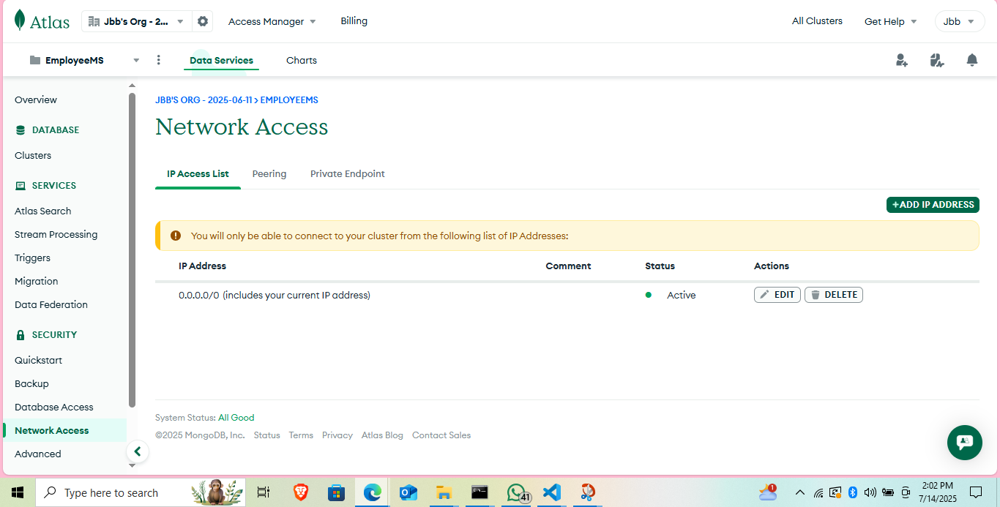

# EMPLOYMENT MANAGEMENT SYSTEM
## DEVELOPER: MARGARET SISIA 

## EMPLOYEE MANAGEMENT SYSTEM
### A web application that allows users to manage their employees' information.
### It includes features such as adding, editing, and deleting employees, as well as viewing all employees.
### It also has the salaries and leaves dashboard to be able to add salaries to employees and also approve or reject the leave application in the Admin Dashboard
### Also in the settings dashboard you can change your password
### In the Employee Dashboard they can be able to view their salaries and also be able to apply for leaves and check the status   whether its been approved or rejected from the admin side .By default after Leave application it will be pending
### Also the employees have a salary dashboard where they can view their salaries after the admin has added. It also has the date of payment
### The application is built using Node.js and Express.js, and is deployed on a cloud server.
### The database is managed using MongoDB, and the application uses a RESTful API to interact with the database.
### The application is designed to be user-friendly and easy to use, with clear and concise instructions for each feature.
### The application is also designed to be scalable and reliable, with regular updates and maintenance to ensure that it continues to function properly.
### The application is available at https://mern-stack-project-frontend-ten.vercel.app/login
### The application uses the following technologies:
### - Node.js
### - Express.js
### - MongoDB
### - RESTful API
### - HTML
### - TAILWIND CSS
### - JavaScript
### - Git
### - GitHub

### THE APPLICATION WAS DEPLOYED ON VERCEL FOR BOTH THE BACKEND AND FRONTEND
  #### THE FRONTED FOLDER IS NAMED AS EMS_PROJECT
  #### THE BACKEND FOLDER IS NAMED AS server

# Logins
### To login as employee
#### Email: dedan@gmail.com
#### Password: Dedan123

### To login as admin
#### Email: okware@gmail.com
#### Password: Okware123

## THE FRONTEND DEPLOYMENT LINK
https://mern-stack-project-frontend-ten.vercel.app/login 


## THE BACKEND DEPLOYMENT LINK
https://mern-stack-project-backend-psi.vercel.app/


## MY MONGODB ATLAS 




## MY 5 MIN VIDEO DEMONSTRATION OF MY APPLICATION IN SERVICE 
https://www.loom.com/share/6b6fcb78e9964a5cba77b8e1e1e713c9?sid=a9c27532-2c74-499e-9fe5-d8ea083ab0ab

## Setup Instructions

1. **Clone the repository**
   ```bash
   git clone https://github.com/your-username/your-repo-name.git
   ```

2. **Navigate to the project folder**
   ```bash
   cd week-8-capstone_-Maggy6973
   ```

3. **Install dependencies for the backend**
   ```bash
   cd server
   npm install
   ```

4. **Set up environment variables**
   - Create a `.env` file in the `server` folder.
   - Add your MongoDB connection string and any other required environment variables.

5. **Start the backend server**
   ```bash
   npm start
   ```

6. **Install dependencies for the frontend**
   ```bash
   cd ../EMS_PROJECT
   npm install
   ```

7. **Start the frontend application**
   ```bash
   npm run dev
   ```

8. **Access the application**
   - Frontend: [http://localhost:3000](http://localhost:3000)
   - Backend: [http://localhost:4000](http://localhost:4000)

> **Note:** Make sure MongoDB Atlas is set up and your connection string is
